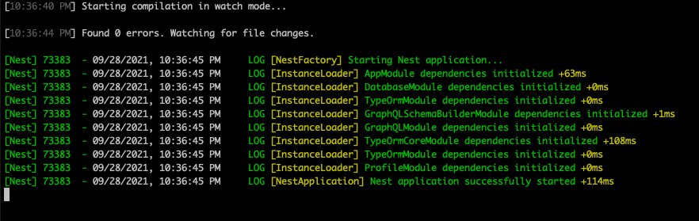
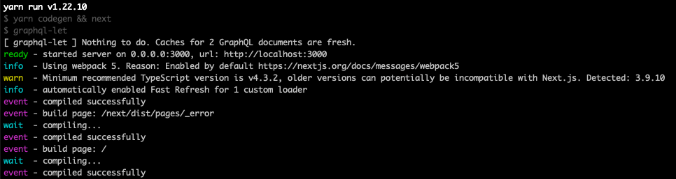
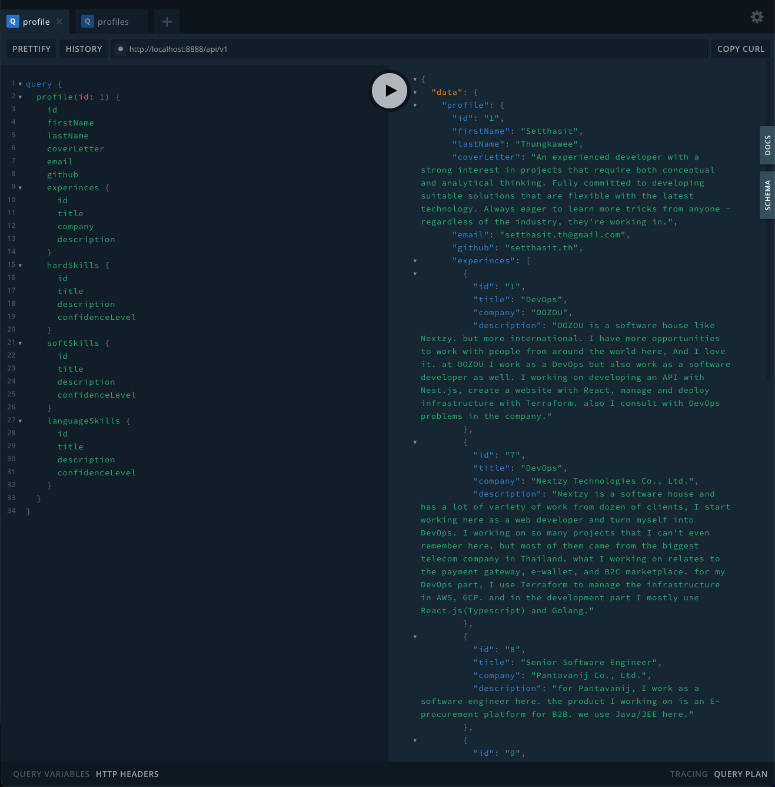
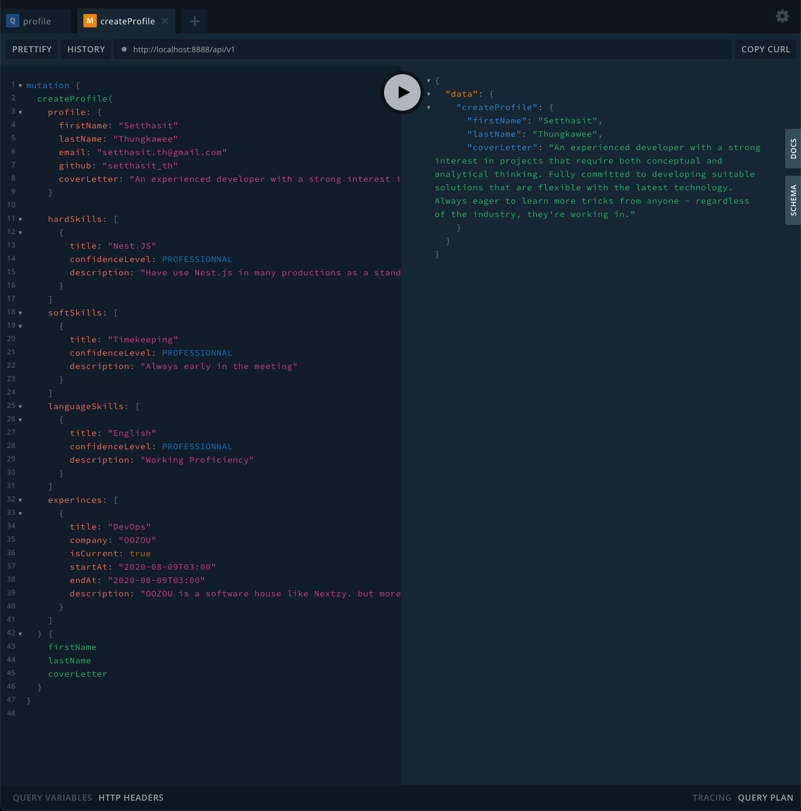

# Three.js Portfolio

This project build for learning purpose, nothing to expected here. and ofcourse nothing make sense here either. this project create to learn the basic of Three.js which contain the functionality of `generate 3d object`, `camera control & positioning`, `Loading 3D model & animation`.

## This Project Create With
Backend: Nest.js + Typescript + GraphQL API
Frontend: Next.js + Typescript + Three.js

## How to run this project

### Docker Compose
To be done next

### Run in Local Machine
1. run `yarn install` at the root of the project
2. change the `env.local` file name to just `.env` in `client-api` and `client-web`
3. run `yarn client-api start:dev` to start the api
4. run `yarn client-web dev` to start the web

you should see console display something similar with this image



### How to use API
API use GraphQL as a API provider, you can open the GraphQL playground by [http://localhost:8888/api/v1](http://localhost:8888/api/v1)

to Query for profile you can use this query to get it
```graphql
query {
	profile(id: 1) {
    id
    firstName
    lastName
    coverLetter
    email
    github
    experinces {
      id
      title
      company
      description
    }
    hardSkills {
      id
      title
      description
      confidenceLevel
    }
    softSkills {
      id
      title
      description
      confidenceLevel
    }
    languageSkills {
      id
      title
      description
      confidenceLevel
    }
	}
}
```


to Create the profile you can archive by using this mutation
```graphql
mutation {
  createProfile(
    profile: {
      firstName: "Setthasit"
      lastName: "Thungkawee"
      email: "setthasit.th@gmail.com"
      github: "setthasit_th"
      coverLetter: "An experienced developer with a strong interest in projects that require both conceptual and analytical thinking. Fully committed to developing suitable solutions that are flexible with the latest technology. Always eager to learn more tricks from anyone - regardless of the industry, they're working in."
    }

    hardSkills: [
      {
        title: "Nest.JS"
        confidenceLevel: PROFESSIONNAL
        description: "Have use Nest.js in many productions as a standard framework"
      }
    ]
    softSkills: [
      {
        title: "Timekeeping"
        confidenceLevel: PROFESSIONNAL
        description: "Always early in the meeting"
      }
    ]
    languageSkills: [
      {
        title: "English"
        confidenceLevel: PROFESSIONNAL
        description: "Working Proficiency"
      }
    ]
    experinces: [
      {
        title: "DevOps"
        company: "OOZOU"
        isCurrent: true
        startAt: "2020-08-09T03:00"
        endAt: "2020-08-09T03:00"
        description: "OOZOU is a software house like Nextzy. but more international. I have more opportunities to work with people from around the world here, And I love it. at OOZOU I work as a DevOps but also work as a software developer as well. I working on developing an API with Nest.js, create a website with React, manage and deploy infrastructure with Terraform. also I consult with DevOps problems in the company."
      }
    ]
  ) {
    firstName
    lastName
    coverLetter
  }
}
```
